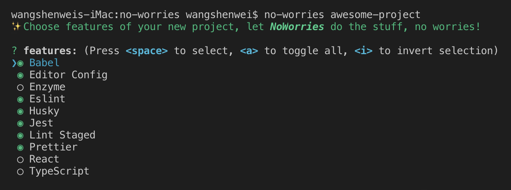

# NoWorries

✨ Choose features of your new project, let _NoWorries_ do the stuff, no worries!



## Install

```shell
npm install -g no-worries
```

## Usage

```shell
no-worries awesome-project
```

## Features

- [x] Babel
- [x] Editor Config
- [x] Enzyme
- [x] Eslint
- [x] Husky
- [x] Jest
- [ ] Lerna
- [x] Lint Staged
- [x] Prettier
- [x] React
- [x] TypeScript
- [ ] Yarn
- [ ] Yarn Workspaces

Maybe?

- [ ] Node
- [ ] Rollup
- [ ] Webpack

## Publish

```shell
npm run release
git push --follow-tags origin master
npm publish
```
